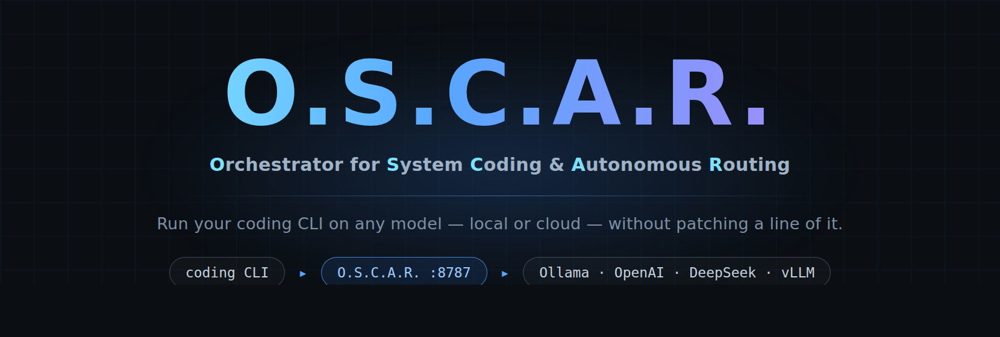

<div align="center">
  
</div>

O.S.C.A.R. is a local translation proxy that lets your coding CLI drive any OpenAI-compatible model.

Point the CLI at O.S.C.A.R. instead of the vendor API and every request is rewritten into OpenAI Chat Completions on the way out and back again on the way in — tools, streaming, images and token accounting included. Local Ollama, DeepSeek, OpenAI, LM Studio, vLLM, or several of them at once, all selectable from the CLI's own `/model` picker. Nothing about the CLI is patched.

[](https://nodejs.org)
[](#development)
[](tsconfig.json)
[](package.json)
[](https://github.com/DeepakGhengat/oscar/issues)
[](LICENSE.md)

[Quick Start](#quick-start) | [Setup Guides](#setup-guides) | [Backends](#supported-backends) | [Configuration](#configuration) | [How It Works](#how-it-works) | [Development](#development) | [Troubleshooting](#troubleshooting)

---

## Why O.S.C.A.R.

- **`/model` actually works.** Most "run this CLI on another model" setups give you a working proxy and a dead model picker — you edit a config file and restart to change models. O.S.C.A.R. makes every model on every configured backend appear in the CLI's own picker, switchable mid-session.
- **Several backends at once.** Local Ollama *and* DeepSeek *and* OpenAI in one list, each with its own base URL and key. Two backends serving the same model name stay individually addressable.
- **It tells you when your key is wrong.** Listing models proves almost nothing — on many hosted backends that endpoint is public. O.S.C.A.R. verifies with a real completion during setup and on demand, so a bad key fails at setup instead of mid-conversation. [Why this matters](#why-listing-models-proves-nothing).
- **Nothing is patched.** The CLI is launched unmodified, against a throwaway profile, and torn down cleanly. Flip one flag and every request goes to the real vendor API untouched.
- **One dependency, no build step.** TypeScript run through `tsx`; 425 offline tests.

## Quick Start

### Requirements

- **Node.js ≥ 18** — check with `node --version`
- **The coding CLI** — the desktop app's bundled copy is found automatically, or install it with `npm i -g @anthropic-ai/claude-code`. O.S.C.A.R. runs *in front of* that CLI and does not install it for you
- **A backend** — [Ollama](https://ollama.com) is the easiest; anything OpenAI-compatible works

### Install

```bash
git clone https://github.com/DeepakGhengat/oscar.git
cd oscar
```

Install it as a product — a real copy, not a symlink to your working tree:

```bash
npm pack
npm install -g ./oscar-0.1.0.tgz
rm oscar-0.1.0.tgz
```

> **Why `npm pack` first?** `npm install -g .` on a local path creates a *symlink* to your checkout rather than an installation. Packing first produces a genuine copy containing only `src/`, `bin/` and `scripts/` — 25 files, about 43 kB.

For development instead, link the working tree so edits take effect immediately:

```bash
npm install && npm link
```

On Windows the steps are identical in PowerShell except for path separators (`.\oscar-0.1.0.tgz`). If PowerShell refuses to run the generated shim, relax its execution policy:

```powershell
Set-ExecutionPolicy -Scope CurrentUser RemoteSigned
```

### Set up

```bash
oscar --setup
```

The wizard asks for a backend, collects a key and model, then **sends one real one-token completion to prove it works** before writing `~/.oscar/.env`.

### Verify and run

```bash
oscar --doctor    # check every backend, ending with a live completion
oscar             # start the proxy and launch the CLI against it
```

Any extra arguments pass straight through to the CLI:

```bash
oscar -p "explain the architecture of this repo"
```

### Fastest local Ollama setup

macOS / Linux:

```bash
ollama pull qwen2.5:7b
oscar --setup     # choose "Ollama (local)", accept the defaults
oscar
```

Or write `~/.oscar/.env` by hand:

```bash
USE_OPENAI_API=1
OPENAI_BASE_URL=http://localhost:11434/v1
OPENAI_API_KEY=ollama
OPENAI_MODEL=qwen2.5:7b
PROXY_PORT=8787
```

### Fastest cloud setup

```bash
USE_OPENAI_API=1
OPENAI_BASE_URL=https://api.deepseek.com/v1
OPENAI_API_KEY=sk-your-key-here
OPENAI_MODEL=deepseek-chat
PROXY_PORT=8787
```

Then run `oscar --doctor` before `oscar` — a hosted backend that lists models without a key will still reject a real completion, and the doctor is what catches that.

### One `/model` list for everything

Turn on **hybrid** and a single session holds your Claude plan *and* your backend models, switchable from `/model` at any time with no restart:

```
/model
  Opus 5 (1M context)          ← your Claude Max plan
  glm-5.2:cloud   (cloud)      ← Ollama Cloud
  qwen2.5:7b      (local)      ← local Ollama
```

The proxy routes per request, on the model id: an alias it advertised goes to the backend and is translated; anything else is an Anthropic tier, so it goes to the vendor on the CLI's own sign-in, untouched.

`oscar --setup` asks once, after the backend is configured. Or set it by hand — hybrid is just the two halves together:

```bash
USE_OPENAI_API=1                 # the backend half
OPENAI_BASE_URL=https://ollama.com/v1
OPENAI_API_KEY=...
OPENAI_MODEL=glm-5.2:cloud
OSCAR_AUTH=subscription          # the Anthropic half
PROXY_PORT=8787
```

In this mode O.S.C.A.R. leaves your credentials alone — no placeholder key, no throwaway profile — because the Anthropic half authenticates as you. It needs a Claude plan (or `ANTHROPIC_API_KEY`); without one, picking a Claude model in `/model` will fail while backend models keep working.

### Switching between Anthropic and open models

Every `oscar --setup` saves what it wrote, so configuring a second backend no longer discards the first:

```bash
oscar --profiles          # ollama         glm-5.2:cloud via ollama.com/v1
                          # ● subscription  Anthropic account sign-in

oscar --use ollama        # switch to open models
oscar --use subscription  # switch back to your Claude plan
```

`--setup` is a first-run wizard and rewrites the whole config. `--use` is the switch.

For a one-off run without changing anything, `USE_OPENAI_API` overrides the file — it is the master switch between the two worlds:

```powershell
$env:USE_OPENAI_API=0; oscar    # Anthropic, just this once
$env:USE_OPENAI_API=1; oscar    # open models, just this once
```

**Why `/model` shows only Claude's models in Anthropic mode:** backend model discovery is deliberately switched off there, because the CLI is talking to Anthropic directly and there is no proxy in between. Switch to an OpenAI-compatible profile and your backend models reappear.

## Setup Guides

- [Windows](docs/WINDOWS.md) — complete PowerShell install and operation guide
- [Getting Started](docs/GETTING_STARTED.md) — zero to working, nothing assumed
- [Backends & Providers](docs/PROVIDERS.md) — single and multi-backend config, token ceilings
- [Troubleshooting](docs/TROUBLESHOOTING.md) — symptom-first, with the reasoning behind each fix

## Supported Backends

Anything exposing OpenAI-compatible `/models` and `/chat/completions` should work. These are wired into the setup wizard as presets:

| Backend | Setup path | Notes |
| --- | --- | --- |
| Ollama (local) | `oscar --setup` → *Ollama* | No real key needed; `http://localhost:11434/v1` |
| Ollama Cloud | `oscar --setup` → *Custom* | Needs a real key — `/models` is public here, so run `--doctor` |
| OpenAI | `oscar --setup` → *OpenAI* | `https://api.openai.com/v1` |
| DeepSeek | `oscar --setup` → *DeepSeek* | `https://api.deepseek.com/v1` |
| LM Studio (local) | `oscar --setup` → *LM Studio* | `http://localhost:1234/v1` |
| vLLM (local) | `oscar --setup` → *vLLM* | `http://localhost:8000/v1` |
| Any OpenAI-compatible | `oscar --setup` → *Custom* | llama.cpp, LiteLLM, OpenRouter, Together, Groq, and others |
| Anthropic account sign-in | `oscar --setup` → *Account sign-in* | Your Pro / Max / Team subscription or enterprise SSO. No key stored — see below |
| Anthropic API key | `oscar --setup` → *API key* | Passthrough with a key you hold |

Several of these can be active at the same time — see [Configuration](#configuration).

### Using your Anthropic subscription

If you pay for Claude — Pro, Max, Team, or an enterprise plan with SSO — you do not need an API key. The CLI signs in against your account and manages its own short-lived credentials.

```bash
oscar --setup     # choose "Anthropic account sign-in" — it asks for nothing else
oscar             # then run /login inside the CLI if you aren't signed in yet
```

The wizard collects no key, no base URL and no port in this mode, because none of them apply. The whole config it writes is:

```bash
OSCAR_AUTH=subscription
```

Or set it directly in `~/.oscar/.env`:

```bash
OSCAR_AUTH=subscription
```

In this mode O.S.C.A.R. **gets out of the way completely**: no proxy is started, `ANTHROPIC_BASE_URL` is left alone, no throwaway config directory is used, and no key is injected. `oscar` stays your single entry point, while `/login`, SSO, Bedrock and Vertex behave exactly as they would if you ran the CLI directly.

Set `OSCAR_PROXY=1` to route through the proxy anyway — useful for the request log. Your sign-in still works: the proxy forwards the CLI's credentials untouched and never adds an `x-api-key` of its own.

> **Why this needed care.** A signed-in CLI sends `Authorization: Bearer …` and no `x-api-key`. The proxy used to force an `x-api-key` header onto every passthrough request, so a subscription login arrived carrying a valid token *and* an empty api-key header — which the API rejects. It now only ever fills a gap, never overwrites. Pinned by tests in `test/subscription-auth.test.ts`.

## What Works

- **Native `/model` picker** — every backend model appears in the CLI's own list, switchable mid-session
- **Multiple backends at once** — each with its own base URL, key and token ceiling
- **Full tool-call translation** — `tool_use` / `tool_result` round-trip correctly, so the agent loop works
- **Streaming** — OpenAI SSE translated into the vendor event stream, token by token
- **Vision** — screenshots and pasted images become `image_url` parts
- **Reasoning models** — chain-of-thought is surfaced when `content` comes back empty, so no blank replies
- **Local token counting** — the CLI keeps accurate context accounting even though the real endpoint is unreachable
- **Per-model token ceilings** — cap a small local model without touching the others
- **Live model hot-swap** — `oscar --switch` changes the model on a *running* proxy from a second terminal
- **Health checks** — `oscar --doctor` proves the setup works with a real completion and exits non-zero on failure
- **Anthropic subscription sign-in** — use your Pro / Max / Team plan or enterprise SSO, no API key needed
- **Passthrough mode** — one flag sends everything to the real vendor API, unmodified

### Which model am I on?

The status line at the bottom of the session always shows it, live:

```
⬢ O.S.C.A.R.  ·  glm-5.2:cloud → cloud  ·  2 backends  ·  D:/oscar
⬢ O.S.C.A.R.  ·  Opus 5 (1M context) → anthropic  ·  D:/oscar
```

It reports the model the session is actually on — not a config default — so it updates the moment you switch with `/model`. The arrow says where requests go: a provider id for your own backends, `anthropic` for the vendor.

Outside a session, `oscar --doctor` reports the configured default, and `oscar --switch` reports what a running proxy is set to.

## Commands

| Command | What it does |
|---|---|
| `oscar` | Start the proxy and launch the CLI against it |
| `oscar --setup` | Interactive wizard; writes `~/.oscar/.env` |
| `oscar --doctor` | Check every backend, ending with a live completion. Exits non-zero on failure |
| `oscar --model` | Pick a model and write it to `.env` |
| `oscar --switch` | Hot-swap the model on a **running** proxy, from a second terminal |
| `oscar --profiles` | List saved configurations |
| `oscar --use <name>` | Switch to a saved configuration |
| `oscar --agent` | Run O.S.C.A.R.'s own built-in agent instead of the coding CLI (OpenAI-compatible backends only) |

## Configuration

### Single backend — `~/.oscar/.env`

| Variable | Purpose | Default |
|---|---|---|
| `USE_OPENAI_API` | `1` routes to your backend; anything else passes through to the vendor API | unset |
| `OPENAI_BASE_URL` | Backend base URL | `https://api.openai.com/v1` |
| `OPENAI_API_KEY` | Backend key | required when routing |
| `OPENAI_MODEL` | Default model | required when routing |
| `OSCAR_MAX_OUTPUT_TOKENS` | Clamp on `max_tokens` — the CLI asks for a 200k-context budget | unset (no clamp) |
| `OSCAR_AUTH` | `subscription` to let the CLI sign in with your account, `api-key` to use a key you hold | inferred from whether a key is set |
| `OSCAR_PROXY` | `1` to route subscription traffic through the proxy anyway | unset (direct launch) |
| `OSCAR_UPSTREAM_BASE_URL` | Passthrough target, if not the default vendor endpoint | `https://api.anthropic.com` |
| `OSCAR_CONFIG` | Config directory | `~/.oscar` |
| `PROXY_PORT` | Port the proxy listens on | `8787` |
| `ANTHROPIC_API_KEY` | Used only in passthrough mode | — |

### Multiple backends — `~/.oscar/providers.json`

```json
{
  "providers": {
    "local": {
      "baseURL": "http://localhost:11434/v1",
      "apiKey": "ollama",
      "models": { "qwen2.5:7b": { "maxOutputTokens": 4096 } }
    },
    "cloud": {
      "baseURL": "https://ollama.com/v1",
      "apiKey": "sk-..."
    },
    "deepseek": {
      "baseURL": "https://api.deepseek.com/v1",
      "apiKey": "sk-...",
      "maxOutputTokens": 8192
    }
  }
}
```

Every backend is probed together and appears in one picker as `model  (provider)`. Each request uses that provider's own base URL and key. Two backends serving the same model name stay individually addressable.

Output-token ceilings resolve **model → provider → `OSCAR_MAX_OUTPUT_TOKENS`**.

Without a `providers.json`, the flat `.env` is used as a single provider — nothing changes for existing setups.

## How It Works

```
  the CLI                    O.S.C.A.R. (localhost:8787)      your backend
  ───────                    ───────────────────────────      ────────────
  ANTHROPIC_BASE_URL ──────► GET  /v1/models      ───────────────► GET  /models
  ANTHROPIC_API_KEY=dummy    POST /v1/messages    ──translate────► POST /chat/completions
                             POST /v1/messages/count_tokens
                                  (answered locally)
                             anything else        ───────────────► the real vendor API
```

### 1. Launch

`oscar` performs nine steps:

1. Load `~/.oscar/.env`
2. Spawn the proxy (`src/server.ts`) as a child process
3. Poll `/healthz` until it answers
4. Point `ANTHROPIC_BASE_URL` at the proxy
5. Set the API key to a dummy value — the proxy ignores it and uses your backend key
6. Point `CLAUDE_CONFIG_DIR` at a throwaway profile, so a stale OAuth token can't override the dummy key
7. Enable gateway model discovery
8. Launch the CLI
9. Tear the proxy down on exit

Meanwhile the proxy **warms its model catalog**, because the next step has a hard deadline.

### 2. Model discovery — the interesting part

The CLI fetches `{ANTHROPIC_BASE_URL}/v1/models?limit=1000` **exactly once** at startup, gives up after 3 seconds, and folds the result into its `/model` picker.

Then it applies this filter to the ids it got back:

```js
data.filter((m) => /^(claude|anthropic)/i.test(m.id))
```

Anything else is silently discarded — which would drop every Ollama model on the floor. So O.S.C.A.R. advertises each model under an alias that survives the filter, and puts the real name in `display_name`, which is what the picker actually renders:

| Sent as `id` | Shown in `/model` |
|---|---|
| `claude-oscar-local-qwen2.5-7b` | `qwen2.5:7b  (local)` |
| `claude-oscar-cloud-glm-5.2` | `glm-5.2  (cloud)` |

Because that fetch happens *once*, a backend that is merely slow on its first request would be missing from `/model` for the entire session. That is why the catalog is warmed at boot with a 15-second budget while the request path keeps a 2.5-second one, and why a partial result is cached for 5 seconds instead of 60.

### 3. Each message

You pick a model; the CLI sends its alias as `body.model`. The proxy:

1. Maps the alias back to a **provider + real model name**
2. Translates the request: system prompt, message history, tool definitions (`input_schema` → `function.parameters`), `tool_use` / `tool_result` blocks, images as data URIs
3. Clamps `max_tokens` (model → provider → global)
4. POSTs to **that provider's** URL with **that provider's** key
5. Translates the response back, including SSE → `message_start` → `content_block_delta` → `message_stop`

Token counting is answered locally, because forwarding it with the dummy key would 401 and cost the CLI its context accounting.

## Why Listing Models Proves Nothing

This is worth internalising, because it produces a failure that looks like something else entirely.

On several hosted backends — Ollama Cloud among them — the model listing endpoint is **public**:

```
GET  /v1/models           no auth header      → 200
GET  /v1/models           made-up key         → 200
POST /v1/chat/completions no auth             → 401
```

So any setup flow that validates by listing models will happily accept a placeholder key like `ollama`. The mistake surfaces much later, mid-conversation, as:

```
Failed to authenticate. API Error: 401 {"error":"Unauthorized"}
```

— which reads as *the CLI's* own login expiring, sending you off to debug entirely the wrong thing.

O.S.C.A.R. handles this in three places: the wizard sends a real completion before writing config, `--doctor` does the same on demand, and the proxy wraps upstream 401s so the message names your backend and the responsible provider.

## Backend Notes

O.S.C.A.R. supports many backends, but they do not all behave identically.

- Tool-calling quality depends heavily on the model. Small local models can struggle with long multi-step tool flows.
- Vendor-specific features have no equivalent on other backends and are dropped in translation.
- Some backends impose lower output caps than the CLI's defaults — that is what `OSCAR_MAX_OUTPUT_TOKENS` and the per-provider ceilings are for.
- Ollama's local model naming (`glm-5.2:cloud`) differs from the cloud API's (`glm-5.2`). `--doctor` reports the closest match when they diverge.
- Reasoning models can spend their whole budget thinking and return empty `content`. O.S.C.A.R. surfaces the reasoning instead of showing a blank reply, but raising `max_tokens` is the real fix.

For best results, use models with strong tool/function-calling support.

## Troubleshooting

**`oscar: command not found`** — your npm global directory isn't on `PATH`. Find it with `npm prefix -g` and add it.

**`spawn claude.exe ENOENT` on Windows** — fixed. `npm i -g @anthropic-ai/claude-code` installs a `claude.cmd` shim rather than a `claude.exe`, and O.S.C.A.R. now searches for both, plus npm's global bin directly. If you still see it, open a new terminal so `PATH` picks up the install.

**`/model` shows no backend models** — check the proxy's startup log for `models: N across M backend(s)`. If a provider is named as not answering, run `oscar --doctor`.

**`Not logged in · Run /login` while a backend is configured** — fixed. The CLI only uses `ANTHROPIC_API_KEY` in an interactive session if the key is pre-approved in its profile; O.S.C.A.R. now writes that approval when it prepares the throwaway profile.

**401 mid-conversation** — your backend rejected its key. `oscar --doctor` will name which provider and why.

**Model works in `--doctor` but not in the CLI** — the model name in `.env` may not match what the backend serves. `--doctor` reports the closest match.

**Blank replies from a reasoning model** — its token budget is being consumed by reasoning. Raise `max_tokens`, or set `OSCAR_MAX_OUTPUT_TOKENS` higher.

Longer, symptom-first version: [docs/TROUBLESHOOTING.md](docs/TROUBLESHOOTING.md).

## Development

```bash
npm install
npm test          # 425 tests, entirely offline
npm run typecheck
npm start         # run just the proxy, without the CLI
```

Unit tests cover translation and config; `catalog-probe` stubs `fetch`; `proxy-routing` and `integration` run in-process mock backends; `server.test.ts` spawns the real proxy and drives every route over HTTP.

Recommended before opening a PR:

- `npm run typecheck`
- `npm test`
- `oscar --doctor` against a real backend when you touched routing, the catalog or the launcher

## Repository Structure

```
src/
├── server.ts        HTTP server: routes, control endpoints, catalog warm-up
├── proxy.ts         Routing: which provider, which model, error envelopes
├── openaiShim.ts    Request/response translation (pure functions)
├── stream.ts        OpenAI SSE → vendor event stream
├── catalog.ts       Model discovery + `claude-oscar-…` aliases
├── providers.ts     Multi-backend config
├── tokens.ts        Local token estimation
├── preflight.ts     Live backend verification
├── doctor.ts        `--doctor`
├── setup.ts         Setup wizard
├── modelpicker.ts   `--model`
├── switchpick.ts    `--switch`
├── env.ts           Config loading + loop guard
└── ui.ts            Terminal UI helpers

bin/        Cross-platform launcher
scripts/    Shell launchers and CLI vendoring
commands/   Slash-command definition
skills/     Skill definition
docs/       Setup, provider and troubleshooting guides
test/       425 tests
```

## Compatibility

Tested against Ollama, local and cloud. Verified with CLI **2.1.219**.

Model discovery relies on the CLI's gateway-discovery behaviour, which is version-dependent. If a future release changes it, `/model` may stop listing backend models while everything else keeps working.

## Repository topics

Discovery metadata lives in two places that must agree: `package.json` keywords, and the repository's GitHub topics. The list, and how to apply it, is in [docs/TOPICS.md](docs/TOPICS.md).

## Contributing

Contributions are welcome. For anything larger than a fix, open an issue first so the scope is clear before implementation. See [Development](#development) for the test and typecheck commands.

## Author

Built by [Deepak Ghengat](https://github.com/DeepakGhengat).

## Licence

MIT — see [LICENSE.md](LICENSE.md).

O.S.C.A.R. is an independent project, not affiliated with, endorsed by, or sponsored by Anthropic. The CLI it drives is Anthropic's software, launched here unmodified; "Claude" and "Claude Code" are trademarks of Anthropic PBC.
